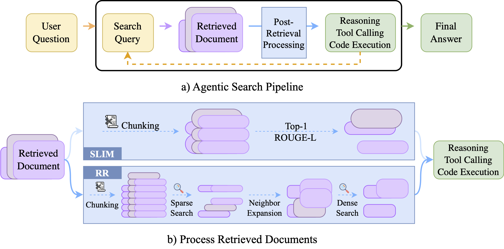

# Skim Before You Reason: Half the Cost, Same Accuracy in Agentic Search

Apply hybrid retrieval on the retrieved web documents to cut the cost of the search agent by 50% at equal or better accuracy. Evaluated on LiveNewsBench, SealQA, DeepSearchQA, BrowseComp-Plus.

## To be updated ...
