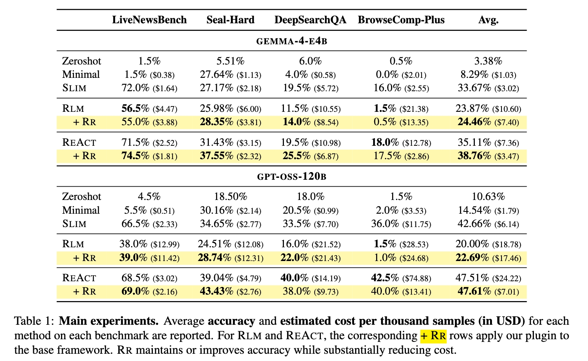

# Skim Before You Reason: Half the Cost, Same Accuracy in Agentic Search

Apply hybrid retrieval on the retrieved web documents to cut the cost of the search agent by 50% at equal or better accuracy. Evaluated on LiveNewsBench, SealQA, DeepSearchQA, BrowseComp-Plus.

> [!NOTE] 
> `Retrive-from-the-retrieved` (in short, `RR`) is our method name.





## Setup

Clone this repository and install the dependencies:

```bash
# install conda if you don't have it yet

git clone https://github.com/vtpss/retrieve-from-the-retrieved
cd retrieve-from-the-retrieved
bash scripts/setup.sh
```


## Run samples

```bash
conda activate benchmark

# start the local search server (used when duckduckgo is not available)
export OPENSERP_PORT=7000
nohup ./openserp/openserp serve -p ${OPENSERP_PORT} > openserp_log.txt 2>&1 &
sleep 5s
curl "http://localhost:${OPENSERP_PORT}/mega/search?text={Python}&engines=duckduckgo&limit=1"

# setup your LiteLLM keys
export LITELLM_BASE_URL=end_point     # "http://localhost:8000/v1"
export LITELLM_MODEL=your_model_name  # "hosted_vllm/gpt-oss-20b"
export LITELLM_API_KEY=your_api_key   # optional for local-hosted models via vLLM/llama.cpp/etc.

# run the agent on samples
python -m agent.main
```


## Evaluation code (to be updated)


## To be updated ...
